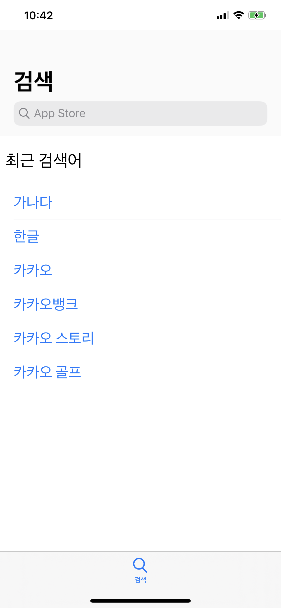
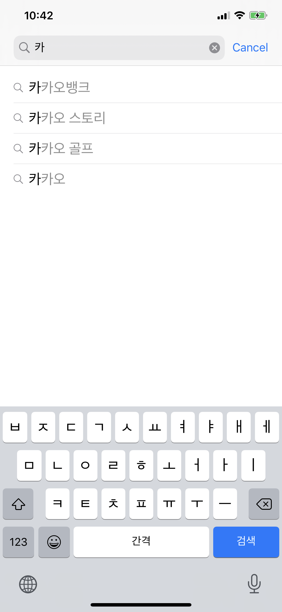
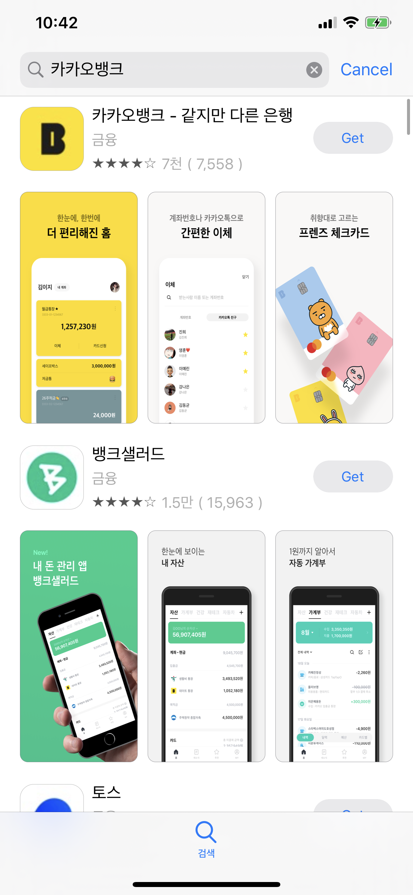
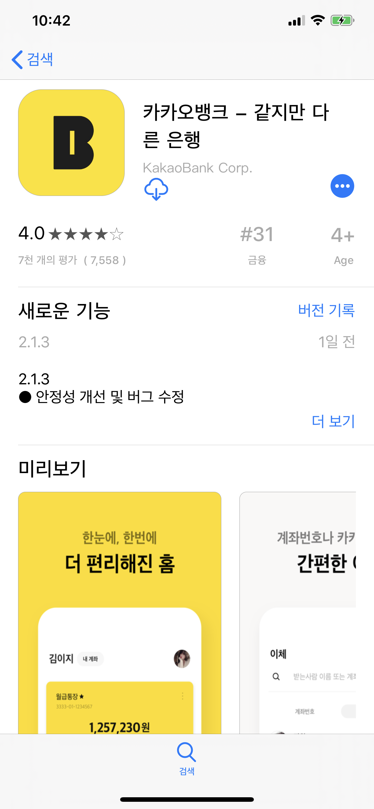

앱스토어 검색 탭 구현하기
=============
#### RxSwfit, RxCocoa를 적용중이라 소스가 더러울 수 있습니다.ㅠ
   
## 사용된 버전
### XCode 11.6, Swift 5
   
## 사용된 오픈소스 
### IQKeyboardManagerSwift
* Link : <https://github.com/hackiftekhar/IQKeyboardManager>
### Cosmos
* Link : <https://github.com/evgenyneu/Cosmos>

### 제출 후
### RxSwift, RxCocoa
* Link : <https://github.com/ReactiveX/RxSwift>

### RxDataSources
* Link : <https://github.com/RxSwiftCommunity/RxDataSources>

### RxCoreData
* Link : <https://github.com/RxSwiftCommunity/RxCoreData>

   
## 화면 스크린 샷
   
### 1. 최근 검색어가 있는 화면
</img>

### 2. 로컬 히스토리의 최근 검색어 표시   
</img>  

### 3. 검색 결과 화면
</img>    

### 4. 앱 상세 화면 
</img>

<del>## 과제 수행 하며 느낀 점
* 앱스토어의 화면을 만들어보는 것은 처음이었고, 많은 생각과 로직을 만들어야 함을 느꼈습니다.   
과제를 수행하며 코드를 잘 만들지는 못 하였지만, 다시 한 번 iOS 개발은 참 재미있다는 것을 느꼈으며,   
RxSwift+MVVM 패턴을 적용시켜 프로젝트를 완성하였으면 더욱(개인적으로..) 좋았을거라 생각되지만,   
이번 프로젝트에는 적용하지 못 하였습니다. 
현재  RxSwift + MVVM를 공부하고 있으며, RxSwift+MVVM을 집중적으로 단련하여 다시 만들어 볼 생각입니다.   
즐거운 시간이었습니다. 
감사합니다! 카뱅! F</del>

## P.S
* TARGETS - Signing & Capabilities 탭에서. TEAM을 None으로 설정 후 Push 하였습니다.

## 2020년 8월 20일 목요일
* 최근 검색어 제안을 제외한 최근 검색어 및 앱 검색된 화면은 Rx로 구성하였습니다.
* 맞게 구현한 것인지는 잘 모르겠습니다. 부족하거나, 사용하면 안되는 코드가 있다면 Issues에 올려주시면 열심히 피드백 해보겠습니다.
* 최근 검색어 제안은 다시 한 번 해보려고 합니다.
* README도 같이 수정해서 올려야하는 데, 자꾸 까먹네요. 항상 체크하고 Push하겠습니다.

## 2020년 8월 21일 금요일
* 앱 상세 보기 페이지에서의 컬렉션뷰 부분을 Rxswift로 적용완료 하였습니다.
* 상세 보기 페이지 자체는 수정 중에 있습니다.

